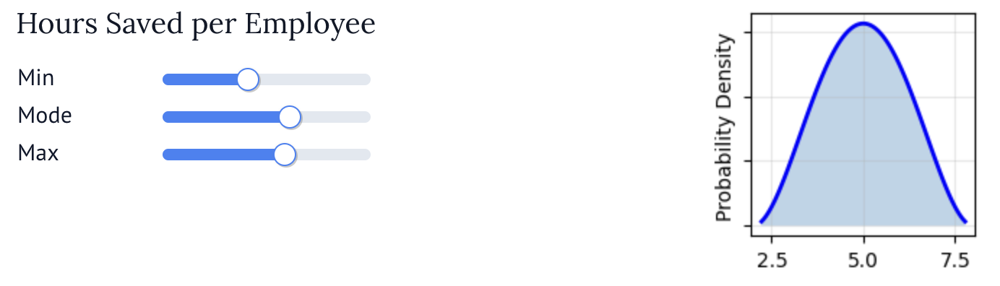

[](https://pypi.org/project/marimo-scipy-utils/)
[](https://github.com/hbmartin/marimo-scipy-utils/actions/workflows/lint.yml)
[](https://github.com/astral-sh/ruff)

# Marimo SciPy Utils

Utility functions for creating interactive marimo components with scipy distributions.

This package provides functions for creating and configuring interactive UI elements in marimo notebooks, with a focus on parameter input and visualization using scipy probability distributions.



## Installation

```bash
uv add marimo-scipy-utils
```

Requires Python 3.12+.

## Quickstart

```python
import marimo as mo
import numpy as np
from marimo_scipy_utils import (
    display_sliders,
    generate_ranges,
    params_sliders,
    sample_invars,
)

invars = {}

# A distribution input: validated ranges -> sliders -> display with live plot
sliders = params_sliders(
    generate_ranges(
        "norm",
        {
            "loc": {"lower": 0, "upper": 100},
            "scale": {"upper": 20},
        },
    )
)
display_sliders("Growth rate", sliders, invars, dist="norm")

# A constant input: a single slider
display_sliders("Discount rate", mo.ui.slider(start=0.0, stop=0.2, step=0.01, value=0.08), invars)

# Monte Carlo: sample every configured input variable
samples = sample_invars(invars, 10_000, rng=np.random.default_rng(0))
```

See the runnable notebook in [`examples/monte_carlo_demo.py`](examples/monte_carlo_demo.py) (`uvx marimo edit examples/monte_carlo_demo.py`), or a larger real-world example in [this NPV model notebook](https://github.com/hbmartin/ai-roi-mcm-npv-marimo/blob/main/ai_roi_mcm_npv.py).

## API

### `display_sliders(name, sliders, invars, dist=None, descriptions=None, *, figsize=(2, 2), color="C0", tail=0.0005) -> mo.Html`

Display parameter sliders with an optional distribution plot.

- A single `mo.ui.slider` is displayed as a constant parameter.
- A `mo.ui.dictionary` of sliders is displayed alongside a live plot of the resulting distribution; `dist` is required and can be the name of any `scipy.stats` distribution (continuous or discrete) or a distribution object.
- The configured variable is stored in `invars[name]` as an `InputVar`.
- `figsize`, `color`, and `tail` (the probability mass trimmed from each end of the plotted range) customize the plot.

Raises `DistributionConfigurationError` if `dist` is omitted for multiple sliders, and `UnknownDistributionError` if `dist` names an unknown distribution.

### `generate_ranges(distribution: str, ranged_distkwargs: dict[str, RangeSpec]) -> dict[str, RangeSpec]`

Validate parameter ranges against the allowed bounds of a distribution and merge them with curated defaults. Supported distributions: `beta`, `norm`, `triang`, `uniform`.

Raises `MissingParameterError` if a required parameter range is not provided, `ParameterBoundError` if a range exceeds the allowed bounds, `ParameterRangeError` for invalid lower/upper ranges, `UnknownParameterError` for unsupported parameters, and `UnknownDistributionError` for distributions without curated bounds.

### `params_sliders(ranged_distkwargs: dict[str, RangeSpec]) -> mo.ui.dictionary`

Create a dictionary of marimo sliders, one per parameter. Each range spec provides `lower` and `upper` bounds and may provide `step` (default `0.1`) and `value` (default: midpoint of the bounds).

```python
sliders = params_sliders({
    "mean": {"lower": 0, "upper": 100, "step": 1, "value": 50},
    "std": {"lower": 0, "upper": 10},
})
```

### `InputVar`

Dataclass describing a configured input variable.

- `dist`: the scipy distribution callable, or `None` for a constant
- `params`: the slider(s) controlling the variable
- `is_constant`: whether the variable is a constant
- `frozen()`: the frozen scipy distribution for the current slider values
- `sample(size, rng=None)`: draw samples (constants return a filled array)

### `sample_invars(invars: dict[str, InputVar], size: int, rng=None) -> dict[str, np.ndarray]`

Sample every configured input variable at once — handy for Monte Carlo simulation.

### `resolve_distribution(dist: str | Callable) -> Callable`

Resolve a distribution name (any `scipy.stats` distribution) or callable to the scipy distribution object.

### `abbrev_format(x: float, pos: int | None = None) -> str`

Format numbers with k/M/B suffixes. Uses Python's round-half-to-even, and negative numbers keep their sign.

```python
abbrev_format(1500)       # "2k"
abbrev_format(2400000)    # "2M"
abbrev_format(3e9)        # "3B"
abbrev_format(-1500)      # "-2k"
abbrev_format(42.7)       # "42.7"
```

## Development

```bash
uv sync
uv run pytest
uv run ruff check && uv run ruff format --check
uv run ty check src
```

## License

Apache-2.0
